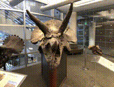

# A 3D Biomedical Segmentation Hub

<figure>
  

    
  

  <figcaption align="center">A collection of state-of-the-art resources for 3D (semi-)automatic interactive segmentation within the biomedical space</figcaption>
</figure>

## Table of Contents

- [A 3D Biomedical Segmentation Hub](#a-3d-biomedical-segmentation-hub)
  - [Table of Contents](#table-of-contents)
  - [Why "A 3D Biomedical Segmentation Hub"?](#why-a-3d-biomedical-segmentation-hub)
    - [Motivation](#motivation)
      - [Keypoints](#keypoints)
  - [Contributing](#contributing)
  - [A Comprehensive Review of 3D Interactive Segmentation Research: Benchmarks, Studies, Papers and Code](#a-comprehensive-review-of-3d-interactive-segmentation-research-benchmarks-studies-papers-and-code)
    - [Benchmarks \& Comparative Studies](#benchmarks--comparative-studies)
    - [3D Segmentation Models](#3d-segmentation-models)
  - [Results and findings of the tested models on synchrotron and electron microscopy data](#results-and-findings-of-the-tested-models-on-synchrotron-and-electron-microscopy-data)
    - [Detailed results](#detailed-results)
    - [Summary](#summary)
  - [Open Source Tooling (incl. GUI)](#open-source-tooling-incl-gui)
    - [Slicer 3D Plugins](#slicer-3d-plugins)
    - [Napari Plugins](#napari-plugins)
  - [Closed Source Tooling](#closed-source-tooling)
  - [Other](#other)

## Why "A 3D Biomedical Segmentation Hub"?

This collection comprises papers and resources tailored for an internal project at the Alexandra Institute. Upon reassessment of its potential industry value, we've opted to open-source it, ensuring accessibility for all. The repository will remain actively maintained throughout the project's duration, continually updated with the latest advancements in the field, as time permits based on the priority of other projects.

### Motivation

Recent advancements in computer vision and artificial intelligence have propelled the development of foundational models, marking a significant stride towards creating versatile models with remarkable accuracy in zero-shot tasks. These models exhibit proficiency in various computer vision tasks, including depth estimation, object detection, and segmentation of unseen objects during training. However, despite their efficacy, current generic segmentation models often overlook highly dimensional data types such as synchrotron and electron microscopy data, due to their availability. This project is motivated by the need to explore the effectiveness of current segmentation solutions, both generic and specialized, in handling synchrotron and electron microscopy data for the task of interactive 3D segmentation. We deem this exploration essential, as the performance of existing models on such data types remains inadequately investigated.

#### Keypoints

- Explore effectiveness of current segmentation solutions for synchrotron and electron microscopy data.
- Investigate performance of existing models on such data types for interactive 3D segmentation.

> **Note:** In the 'basics' section, you'll find essential information to enhance your understanding of 3D interactive segmentation. This includes concise descriptions, examples, visualizations, and additional sources for further reading related to 3D interactive and semi-automatic segmentation of volumetric data, including synchrotron and microscopy data. Click: [here](basics/README.md)

## Contributing

If you believe there are any omissions or have suggestions (papers, implementations, and other resources), please feel free to submit a pull request or send a direct message to: [david.parham@alexandra.dk](mailto:david.parham@alexandra.dk)

Feedback and contributions are welcome and appreciated!

## A Comprehensive Review of 3D Interactive Segmentation Research: Benchmarks, Studies, Papers and Code

### Benchmarks & Comparative Studies

| Date |Title | Authors | Paper |
|---|---|---|---|
|12/2023 |When SAM Meets Medical Images: An Investigation of Segment Anything Model (SAM) on Multi-phase Liver Tumor Segmentation | Hu, Chuanfei and Xinde Li | [PDF](https://arxiv.org/pdf/2304.08506.pdf) |
|10/2023|Segment Anything Model for Medical Image Analysis: an Experimental Study | Mazurowski, Maciej A. et al. | [PDF](https://arxiv.org/pdf/2304.10517.pdf) | [GitHub](https://github.com/mazurowski-lab/segment-anything-medical-evaluation) |
|05/2023| Computer-Vision Benchmark Segment-Anything Model (SAM) in Medical Images: Accuracy in 12 Datasets | He, Sheng et al. | [PDF](https://arxiv.org/pdf/2304.09324.pdf) |
| 11/2021 | Recent advances and clinical applications of deep learning in medical image analysis | Chen, Xuxin et al. | [PDF](https://arxiv.org/pdf/2105.13381v1.pdf) | [GitHub](https://github.com/xuxinchen93/medical-segmentation-review) |

### 3D Segmentation Models

| Date |Title | Authors | Paper | Code | Tested |
|---|---|---|---|---|---|
|03/2024|iSegFormer: Interactive Segmentation via Transformers with Application to 3D Knee MR Images | Qin Liu et al. | [PDF](https://arxiv.org/pdf/2112.11325.pdf) | [GitHub](https://github.com/uncbiag/iSegFormer) | :white_square_button: |
| 12/2023 | ScribblePrompt: Fast and Flexible Interactive Segmentation for Any Medical Image | Hallee E. Wong et al. | [PDF](https://arxiv.org/pdf/2312.07381.pdf) | [Project Page](https://scribbleprompt.csail.mit.edu/) | :ballot_box_with_check: |
| 07/2023 | SwinMM: Masked Multi-view with Swin Transformers for 3D Medical Image Segmentation | Wang, Yiqing et al. | [PDF](https://arxiv.org/pdf/2307.12591.pdf) | [GitHub](https://github.com/UCSC-VLAA/SwinMM/) | :white_square_button: |
|06/2023|3DSAM-adapter: Holistic Adaptation of SAM from 2D to 3D for Portable Medical Image Segmentation | Gong, Shizhan et al. | [PDF](https://arxiv.org/pdf/2306.13465.pdf) | [GitHub](https://github.com/med-air/3DSAM-adapter) | :white_square_button: |
|06/2023|TomoSAM: a 3D Slicer extension using SAM for tomography segmentation | Semeraro, Federico et al. | [PDF](https://arxiv.org/pdf/2306.08609.pdf) | [GitHub](https://github.com/fsemerar/SlicerTomoSAM) | :ballot_box_with_check: |
|05/2023| DeepEdit: Deep Editable Learning for Interactive Segmentation of 3D Medical Images | Diaz-Pinto, Andrés et al. | [PDF](https://arxiv.org/abs/2305.10655) | [GitHub](https://github.com/Project-MONAI/MONAILabel?utm_source=catalyzex.com) | :ballot_box_with_check: |
| 05/2023 |Seq2Link: an efficient and versatile solution for semi-automatic cell segmentation in 3D image stacks | Wen, Chentao et al. | [PDF](https://www.nature.com/articles/s41598-023-34232-6) | [GitHub](https://github.com/WenChentao/Seg2Link) | :ballot_box_with_check: |
|04/2023|Segment Anything in 3D with NeRFs | Cen, Jiazhong et al. | [PDF](https://arxiv.org/pdf/2304.12308.pdf) | [GitHub](https://github.com/Jumpat/SegmentAnythingin3D) | :white_square_button: |
|01/2023|Volumetric memory network for interactive medical image segmentation | Zhou, Tianfei et al. | [PDF](https://www.sciencedirect.com/science/article/pii/S1361841522002316) | [GitHub](https://github.com/0liliulei/Mem3D) | :white_square_button: |
|XX/2022|i3Deep: Efficient 3D interactive segmentation with the nnU-Net | Gotkowski, Karol et al. | [PDF](https://openreview.net/pdf?id=R420Pr5vUj3) | [GitHub](https://github.com/Karol-G/i3Deep) | :ballot_box_with_check: |
| 09/2022 | Understanding the Tricks of Deep Learning in Medical Image Segmentation: Challenges and Future Directions | Zhang, Dong-Ming et al. | [PDF](https://arxiv.org/pdf/2209.10307.pdf) | [GitHub](https://github.com/hust-linyi/MedISeg?utm_source=catalyzex.com) | :white_square_button: |
| 06/2022 | Dynamic Linear Transformer for 3D Biomedical Image Segmentation | Zhang, Zheyu and Ulas Bagci | [PDF](https://arxiv.org/pdf/2206.00771.pdf) | [GitHub](https://github.com/freshman97/LinTransUNet) | :white_square_button: |
| 02/2022 | Beyond automatic medical image segmentation - the spectrum between fully manual and fully automatic delineation | Trimpl, Michael Johann et al. | [PDF](https://iopscience.iop.org/article/10.1088/1361-6560/ac6d9c) | - | :white_square_button: |

> *A more detailed literature review for specifically applying SAM and it's variants for medical image segmentation can be found at the GitHub repository [SAM4MIS](https://github.com/YichiZhang98/SAM4MIS) from YichiZhang98.*

## Results and findings of the tested models on synchrotron and electron microscopy data

The following section portrays the summarized finding of the tested models on synchrotron and electron microscopy data, as well as links leading to more in depth reports on the tested models.

### Detailed results

| Title | Link |
|---|---|
| ScribblePrompt: Fast and Flexible Interactive Segmentation for Any Medical Image | [Report](reports/ScribblePrompt/README.md) |
| TomoSAM: a 3D Slicer extension using SAM for tomography segmentation | [Report](reports/TomoSAM/README.md) |
| DeepEdit: Deep Editable Learning for Interactive Segmentation of 3D Medical Images | [Report](reports/DeepEdit/README.md) |
| Seq2Link: an efficient and versatile solution for semi-automatic cell segmentation in 3D image stacks | [Report](reports/Seq2Link/README.md) |
| i3Deep: Efficient 3D interactive segmentation with the nnU-Net | [Report](reports/i3Deep/README.md) |

### Summary

## Open Source Tooling (incl. GUI)

### Slicer 3D Plugins

- [TomoSAM](https://github.com/fsemerar/SlicerTomoSAM) - (Segment Anything for tomography data)
- [DeepEdit](https://github.com/Project-MONAI/MONAILabel/wiki/DeepEdit) - ()
- [SAMM](https://github.com/bingogome/samm) - (Segment Any Medical Model)
- [MedSAM-Lite](https://github.com/bowang-lab/MedSAMSlicer) - (Segment Anything in Medical Images)

### Napari Plugins

- [Segmenter](https://www.allencell.org/segmenter.html) - ()
- [Seg2Link](https://github.com/WenChentao/Seg2Link) -()

## Closed Source Tooling

- [Webknossos](https://webknossos.org/)
- [Dragonfly](https://www.theobjects.com/dragonfly/index.html)

## Other

- [Biomedisa](https://biomedisa.info/)
- [PaddleSeg](https://github.com/PaddlePaddle/PaddleSeg/tree/release/2.6)
- [TurtleSeg](https://www.medicalimageanalysis.com/software/turtleseg)
- [Ilastik]()

<!-- ## License

 This work is licensed under a <a rel="license" href="http://creativecommons.org/licenses/by/4.0/">Creative Commons Attribution 4.0 International License</a>. -->
