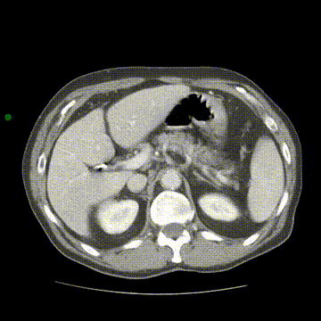

# A 3D Biomedical Segmentation Hub

<figure>
  

    
  

  <figcaption align="center">A collection of state-of-the-art resources for 3D (semi-)automatic interactive segmentation within the biomedical space</figcaption>
</figure>

## Why "A 3D Biomedical Segmentation Hub"?

This collection comprises papers and resources tailored for an internal project at the Alexandra Institute. Upon reassessment of its potential industry value, we've opted to open-source it, ensuring accessibility for all. The repository will remain actively maintained throughout the project's duration, continually updated with the latest advancements in the field, as time permits based on the priority of other projects.

### Motivation

Recent advancements in computer vision and artificial intelligence have propelled the development of foundational models, marking a significant stride towards creating versatile models with remarkable accuracy in zero-shot tasks. These models exhibit proficiency in various computer vision tasks, including depth estimation, object detection, and segmentation of unseen objects during training. However, despite their efficacy, current generic segmentation models often overlook highly dimensional data types such as synchrotron and electron microscopy data, due to their availability. This project is motivated by the need to explore the effectiveness of current segmentation solutions, both generic and specialized, in handling synchrotron and electron microscopy data for the task of interactive 3D segmentation. We deem this exploration essential, as the performance of existing models on such data types remains inadequately investigated.

#### Keypoints

- Explore effectiveness of current segmentation solutions for synchrotron and electron microscopy data.
- Investigate performance of existing models on such data types for interactive 3D segmentation.

## Contributing

If you believe there are any omissions or have suggestions (papers, implementations, and other resources), please feel free to submit a pull request or send a direct message to: [david.parham@alexandra.dk](mailto:david.parham@alexandra.dk)

Feedback and contributions are welcome and appreciated!

## Table of Contents

- [A 3D Biomedical Segmentation Hub](#a-3d-biomedical-segmentation-hub)
  - [Why "A 3D Biomedical Segmentation Hub"?](#why-a-3d-biomedical-segmentation-hub)
    - [Motivation](#motivation)
      - [Keypoints](#keypoints)
  - [Contributing](#contributing)
  - [Table of Contents](#table-of-contents)
  - [Foundation](#foundation)
    - [3D Interactive Segmentation](#3d-interactive-segmentation)
    - [3D Semi-automatic Segmentation](#3d-semi-automatic-segmentation)
    - [Understanding Volumetric Synchrotron and Electron Microscopy Data](#understanding-volumetric-synchrotron-and-electron-microscopy-data)
      - [Volumetric Data Overview](#volumetric-data-overview)
      - [Synchrotron Tomography Data](#synchrotron-tomography-data)
        - [Characteristics](#characteristics)
      - [Electron Microscopy Data](#electron-microscopy-data)
        - [Characteristics](#characteristics-1)
      - [Differences from Conventional Volumetric Data](#differences-from-conventional-volumetric-data)
    - [Resources for additional knowledge acquisition](#resources-for-additional-knowledge-acquisition)
  - [A Comprehensive Review of 3D Interactive Segmentation Research: Benchmarks, Studies, Papers and Code](#a-comprehensive-review-of-3d-interactive-segmentation-research-benchmarks-studies-papers-and-code)
    - [Benchmarks \& Comparative Studies](#benchmarks--comparative-studies)
    - [3D Segmentation Models](#3d-segmentation-models)
  - [Results and findings of the tested models on synchrotron and electron microscopy data](#results-and-findings-of-the-tested-models-on-synchrotron-and-electron-microscopy-data)
    - [Detailed results](#detailed-results)
    - [Summary](#summary)
  - [Open Source Tooling (incl. GUI)](#open-source-tooling-incl-gui)
    - [Slicer 3D Plugins](#slicer-3d-plugins)
    - [Napari Plugins](#napari-plugins)
  - [Closed Source Tooling](#closed-source-tooling)
  - [Other](#other)

## Foundation

### 3D Interactive Segmentation

**Definition**: 3D interactive segmentation involves user interaction and manipulation to delineate object boundaries in a three-dimensional (3D) image or volume. The user actively participates in the segmentation process by providing input, such as drawing or editing regions of interest, to guide the segmentation algorithm.

<figure>
  

    
  

  <figcaption align="center">In a medical imaging application, a radiologist may use a 3D interactive segmentation tool to manually trace the boundaries of a tumor in a series of volumetric images. The tool provides real-time visualization and feedback, allowing the radiologist to adjust and refine the segmentation boundaries based on their expertise.</figcaption>
</figure>

### 3D Semi-automatic Segmentation

**Definition**: 3D semi-automatic segmentation combines the advantages of both manual interaction and automated algorithms. It involves an initial automatic segmentation step followed by user intervention to review and refine the results. The user interacts with the segmentation system to correct errors or provide additional guidance, improving the accuracy of the segmentation.

<figure>
  

    
  

  <figcaption align="center"> In a 3D medical imaging application, a semi-automatic segmentation approach may involve using an algorithm, such as region growing or active contours, to generate an initial segmentation of a specific anatomical structure. The user then reviews the segmentation results and adjusts boundaries as needed, ensuring accurate representation of the structure.</figcaption>
</figure>

### Understanding Volumetric Synchrotron and Electron Microscopy Data

In this section, we will delve into the intricacies of volumetric synchrotron and electron microscopy data. These types of data hold significant importance in various fields, particularly in materials science, biology, and medical imaging. We will explore their characteristics, acquisition methods, and how they differ from more conventional volumetric data types.

#### Volumetric Data Overview

Volumetric data refers to three-dimensional datasets representing information within a volume. Unlike traditional two-dimensional images, which consist of pixels arranged in rows and columns, volumetric data adds an additional dimension, forming a stack of image slices along the z-axis. This third dimension provides depth and allows for the representation of complex structures and phenomena within the volume.

#### Synchrotron Tomography Data

Synchrotron tomography is a powerful imaging technique utilized to capture detailed three-dimensional information about the internal structure of materials. It involves the use of synchrotron radiation—a highly intense and collimated beam of X-rays—to probe the sample.

##### Characteristics

- High resolution: Synchrotron tomography offers exceptionally high spatial resolution, enabling the visualization of fine details within the sample.
- Penetrative ability: Synchrotron X-rays can penetrate dense materials, allowing for the examination of internal structures without the need for destructive sample preparation.
- Contrast enhancement: Various contrast mechanisms, such as absorption, phase contrast, and fluorescence, can be leveraged to enhance the visibility of specific features within the sample.

#### Electron Microscopy Data

Electron microscopy is another powerful imaging technique that utilizes a focused beam of electrons to generate high-resolution images of specimens. In the context of volumetric data, electron microscopy can provide detailed insights into the microstructure of biological samples, materials, and nanoscale objects.

##### Characteristics

- Sub-nanometer resolution: Electron microscopes can achieve sub-nanometer resolution, making them capable of resolving individual molecules and atomic structures.
- Specimen preparation: Electron microscopy often requires meticulous sample preparation techniques, including fixation, staining, and ultrathin sectioning.
- Contrast mechanisms: Various contrast mechanisms, such as electron density, atomic number, and diffraction, contribute to the contrast observed in electron microscopy images.

#### Differences from Conventional Volumetric Data

While both synchrotron and electron microscopy data share similarities with conventional volumetric data types, such as medical CT scans and MRI volumes, they exhibit several distinct characteristics:

- Resolution: Synchrotron and electron microscopy data often achieve much higher spatial resolutions compared to medical imaging modalities, enabling the visualization of ultrafine structures.
- Sample preparation: Unlike medical imaging, which often involves non-destructive imaging of living organisms, synchrotron and electron microscopy typically require extensive sample preparation, including fixation, staining, and sectioning.
- Contrast mechanisms: Synchrotron and electron microscopy data rely on different contrast mechanisms, such as X-ray absorption and electron scattering, compared to medical imaging techniques.

> Sum-up:  Volumetric synchrotron and electron microscopy data offer unprecedented insights into the microstructure and morphology of materials at various length scales. By understanding their unique characteristics and differences from conventional volumetric data types, researchers can harness their full potential for scientific discovery and technological advancement.

### Resources for additional knowledge acquisition

- [Unite.AI - Segment Anything Model in Computer Vision Gets a Massive Boost](https://www.unite.ai/segment-anything-model-computer-vision-gets-a-massive-boost/)
- [Towards Data Science - See What You SAM](https://towardsdatascience.com/see-what-you-sam-4eea9ad9a5de)
- [OpenReview - Segment Anything Model](https://openreview.net/pdf?id=iilLHaINUW)
- [HuggingFace - SAM Model Documentation](https://huggingface.co/docs/transformers/main/model_doc/sam)
- [YouTube - SAM Model Demo](https://www.youtube.com/watch?v=vZK45noZVIA)
- [GitHub - SAM-Medical-Imaging Implementation](https://github.com/amine0110/SAM-Medical-Imaging)
- [MarkTechPost - When SAM Meets NeRF: This AI Model Can Segment Anything in 3D](https://www.marktechpost.com/2023/05/22/when-sam-meets-nerf-this-ai-model-can-segment-anything-in-3d/)
- [GitHub - SegmentAnythingin3D](https://github.com/Jumpat/SegmentAnythingin3D)
- [GitHub Topics - Interactive Segmentation](https://github.com/topics/interactive-segmentation)
- [GitHub - SegmentAnything3D](https://github.com/Pointcept/SegmentAnything3D)
- [GitHub - SAM-3D-Selector](https://github.com/nexuslrf/SAM-3D-Selector)

## A Comprehensive Review of 3D Interactive Segmentation Research: Benchmarks, Studies, Papers and Code

### Benchmarks & Comparative Studies

| Date |Title | Authors | Paper |
|---|---|---|---|
|12/2023 |When SAM Meets Medical Images: An Investigation of Segment Anything Model (SAM) on Multi-phase Liver Tumor Segmentation | Hu, Chuanfei and Xinde Li | [PDF](https://arxiv.org/pdf/2304.08506.pdf) |
|10/2023|Segment Anything Model for Medical Image Analysis: an Experimental Study | Mazurowski, Maciej A. et al. | [PDF](https://arxiv.org/pdf/2304.10517.pdf) | [GitHub](https://github.com/mazurowski-lab/segment-anything-medical-evaluation) |
|05/2023| Computer-Vision Benchmark Segment-Anything Model (SAM) in Medical Images: Accuracy in 12 Datasets | He, Sheng et al. | [PDF](https://arxiv.org/pdf/2304.09324.pdf) |
| 11/2021 | Recent advances and clinical applications of deep learning in medical image analysis | Chen, Xuxin et al. | [PDF](https://arxiv.org/pdf/2105.13381v1.pdf) | [GitHub](https://github.com/xuxinchen93/medical-segmentation-review) |

### 3D Segmentation Models

| Date |Title | Authors | Paper | Code | Tested |
|---|---|---|---|---|---|
|03/2024|iSegFormer: Interactive Segmentation via Transformers with Application to 3D Knee MR Images | Qin Liu et al. | [PDF](https://arxiv.org/pdf/2112.11325.pdf) | [GitHub](https://github.com/uncbiag/iSegFormer) | :white_square_button: |
| 12/2023 | ScribblePrompt: Fast and Flexible Interactive Segmentation for Any Medical Image | Hallee E. Wong et al. | [PDF](https://arxiv.org/pdf/2312.07381.pdf) | [Project Page](https://scribbleprompt.csail.mit.edu/) | :ballot_box_with_check: |
| 07/2023 | SwinMM: Masked Multi-view with Swin Transformers for 3D Medical Image Segmentation | Wang, Yiqing et al. | [PDF](https://arxiv.org/pdf/2307.12591.pdf) | [GitHub](https://github.com/UCSC-VLAA/SwinMM/) | :white_square_button: |
|06/2023|3DSAM-adapter: Holistic Adaptation of SAM from 2D to 3D for Portable Medical Image Segmentation | Gong, Shizhan et al. | [PDF](https://arxiv.org/pdf/2306.13465.pdf) | [GitHub](https://github.com/med-air/3DSAM-adapter) | :white_square_button: |
|06/2023|TomoSAM: a 3D Slicer extension using SAM for tomography segmentation | Semeraro, Federico et al. | [PDF](https://arxiv.org/pdf/2306.08609.pdf) | [GitHub](https://github.com/fsemerar/SlicerTomoSAM) | :ballot_box_with_check: |
|05/2023| DeepEdit: Deep Editable Learning for Interactive Segmentation of 3D Medical Images | Diaz-Pinto, Andrés et al. | [PDF](https://arxiv.org/abs/2305.10655) | [GitHub](https://github.com/Project-MONAI/MONAILabel?utm_source=catalyzex.com) | :ballot_box_with_check: |
| 05/2023 |Seq2Link: an efficient and versatile solution for semi-automatic cell segmentation in 3D image stacks | Wen, Chentao et al. | [PDF](https://www.nature.com/articles/s41598-023-34232-6) | [GitHub](https://github.com/WenChentao/Seg2Link) | :ballot_box_with_check: |
|04/2023|Segment Anything in 3D with NeRFs | Cen, Jiazhong et al. | [PDF](https://arxiv.org/pdf/2304.12308.pdf) | [GitHub](https://github.com/Jumpat/SegmentAnythingin3D) | :white_square_button: |
|01/2023|Volumetric memory network for interactive medical image segmentation | Zhou, Tianfei et al. | [PDF](https://www.sciencedirect.com/science/article/pii/S1361841522002316) | [GitHub](https://github.com/0liliulei/Mem3D) | :white_square_button: |
|XX/2022|i3Deep: Efficient 3D interactive segmentation with the nnU-Net | Gotkowski, Karol et al. | [PDF](https://openreview.net/pdf?id=R420Pr5vUj3) | [GitHub](https://github.com/Karol-G/i3Deep) | :ballot_box_with_check: |
| 09/2022 | Understanding the Tricks of Deep Learning in Medical Image Segmentation: Challenges and Future Directions | Zhang, Dong-Ming et al. | [PDF](https://arxiv.org/pdf/2209.10307.pdf) | [GitHub](https://github.com/hust-linyi/MedISeg?utm_source=catalyzex.com) | :white_square_button: |
| 06/2022 | Dynamic Linear Transformer for 3D Biomedical Image Segmentation | Zhang, Zheyu and Ulas Bagci | [PDF](https://arxiv.org/pdf/2206.00771.pdf) | [GitHub](https://github.com/freshman97/LinTransUNet) | :white_square_button: |
| 02/2022 | Beyond automatic medical image segmentation - the spectrum between fully manual and fully automatic delineation | Trimpl, Michael Johann et al. | [PDF](https://iopscience.iop.org/article/10.1088/1361-6560/ac6d9c) | - | :white_square_button: |

> *A more detailed literature review for specifically applying SAM and it's variants for medical image segmentation can be found at the GitHub repository [SAM4MIS](https://github.com/YichiZhang98/SAM4MIS) from YichiZhang98.*

## Results and findings of the tested models on synchrotron and electron microscopy data

The following section portrays the summarized finding of the tested models on synchrotron and electron microscopy data, as well as links leading to more in depth reports on the tested models.

### Detailed results

| Title | Link |
|---|---|
| ScribblePrompt: Fast and Flexible Interactive Segmentation for Any Medical Image | [Report]() |
| TomoSAM: a 3D Slicer extension using SAM for tomography segmentation | [Report]() |
| DeepEdit: Deep Editable Learning for Interactive Segmentation of 3D Medical Images | [Report]() |
| Seq2Link: an efficient and versatile solution for semi-automatic cell segmentation in 3D image stacks | [Report]() |
| i3Deep: Efficient 3D interactive segmentation with the nnU-Net | [Report]() |

### Summary

## Open Source Tooling (incl. GUI)

### Slicer 3D Plugins

- [TomoSAM](https://github.com/fsemerar/SlicerTomoSAM) - (Segment Anything for tomography data)
- [DeepEdit](https://github.com/Project-MONAI/MONAILabel/wiki/DeepEdit) - ()
- [SAMM](https://github.com/bingogome/samm) - (Segment Any Medical Model)
- [MedSAM-Lite](https://github.com/bowang-lab/MedSAMSlicer) - (Segment Anything in Medical Images)

### Napari Plugins

- [Segmenter](https://www.allencell.org/segmenter.html) - ()
- [Seg2Link](https://github.com/WenChentao/Seg2Link) -()

## Closed Source Tooling

- [Webknossos](https://webknossos.org/)
- [Dragonfly](https://www.theobjects.com/dragonfly/index.html)

## Other

- [Biomedisa](https://biomedisa.info/)
- [PaddleSeg](https://github.com/PaddlePaddle/PaddleSeg/tree/release/2.6)
- [TurtleSeg](https://www.medicalimageanalysis.com/software/turtleseg)

<!-- ## License

 This work is licensed under a <a rel="license" href="http://creativecommons.org/licenses/by/4.0/">Creative Commons Attribution 4.0 International License</a>. -->
