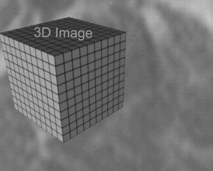

# Basics

**The following sections provide a brief overview of the key concepts and characteristics of 3D interactive and semi-automatic segmentation.**

--- 

## 3D Interactive Segmentation

**Definition**: 3D interactive segmentation involves user interaction and manipulation to delineate object boundaries in a three-dimensional (3D) image or volume. The user actively participates in the segmentation process by providing input, such as drawing or editing regions of interest, to guide the segmentation algorithm.

<figure>
  

    
  

  <figcaption align="center">In a medical imaging application, a radiologist may use a 3D interactive segmentation tool to manually trace the boundaries of a tumor in a series of volumetric images. The tool provides real-time visualization and feedback, allowing the radiologist to adjust and refine the segmentation boundaries based on their expertise.</figcaption>
</figure>

## 3D Semi-automatic Segmentation

**Definition**: 3D semi-automatic segmentation combines the advantages of both manual interaction and automated algorithms. It involves an initial automatic segmentation step followed by user intervention to review and refine the results. The user interacts with the segmentation system to correct errors or provide additional guidance, improving the accuracy of the segmentation.

<figure>
  

    
  

  <figcaption align="center"> In a 3D medical imaging application, a semi-automatic segmentation approach may involve using an algorithm, such as region growing or active contours, to generate an initial segmentation of a specific anatomical structure. The user then reviews the segmentation results and adjusts boundaries as needed, ensuring accurate representation of the structure.</figcaption>
</figure>

## Understanding Volumetric Synchrotron and Electron Microscopy Data

In this section, we will delve into the intricacies of volumetric synchrotron and electron microscopy data. These types of data hold significant importance in various fields, particularly in materials science, biology, and medical imaging. We will explore their characteristics, acquisition methods, and how they differ from more conventional volumetric data types.

### Volumetric Data Overview

Volumetric data refers to three-dimensional datasets representing information within a volume. Unlike traditional two-dimensional images, which consist of pixels arranged in rows and columns, volumetric data adds an additional dimension, forming a stack of image slices along the z-axis. This third dimension provides depth and allows for the representation of complex structures and phenomena within the volume.

<figure>
  

    
  

  <figcaption align="center"> Dynamic transition between a full 3D volume stack and one single slice of the stack. Source:(https://www.medicalimageanalysis.com/software/turtleseg) </figcaption>
</figure>

### Synchrotron Tomography Data

Synchrotron tomography is a powerful imaging technique utilized to capture detailed three-dimensional information about the internal structure of materials. It involves the use of synchrotron radiation—a highly intense and collimated beam of X-rays—to probe the sample.

### Characteristics

- High resolution: Synchrotron tomography offers exceptionally high spatial resolution, enabling the visualization of fine details within the sample.
- Penetrative ability: Synchrotron X-rays can penetrate dense materials, allowing for the examination of internal structures without the need for destructive sample preparation.
- Contrast enhancement: Various contrast mechanisms, such as absorption, phase contrast, and fluorescence, can be leveraged to enhance the visibility of specific features within the sample.

### Electron Microscopy Data

Electron microscopy is another powerful imaging technique that utilizes a focused beam of electrons to generate high-resolution images of specimens. In the context of volumetric data, electron microscopy can provide detailed insights into the microstructure of biological samples, materials, and nanoscale objects.

#### Characteristics

- Sub-nanometer resolution: Electron microscopes can achieve sub-nanometer resolution, making them capable of resolving individual molecules and atomic structures.
- Specimen preparation: Electron microscopy often requires meticulous sample preparation techniques, including fixation, staining, and ultrathin sectioning.
- Contrast mechanisms: Various contrast mechanisms, such as electron density, atomic number, and diffraction, contribute to the contrast observed in electron microscopy images.

### Differences from Conventional Volumetric Data

While both synchrotron and electron microscopy data share similarities with conventional volumetric data types, such as medical CT scans and MRI volumes, they exhibit several distinct characteristics:

- Resolution: Synchrotron and electron microscopy data often achieve much higher spatial resolutions compared to medical imaging modalities, enabling the visualization of ultrafine structures.
- Sample preparation: Unlike medical imaging, which often involves non-destructive imaging of living organisms, synchrotron and electron microscopy typically require extensive sample preparation, including fixation, staining, and sectioning.
- Contrast mechanisms: Synchrotron and electron microscopy data rely on different contrast mechanisms, such as X-ray absorption and electron scattering, compared to medical imaging techniques.

> Sum-up:  Volumetric synchrotron and electron microscopy data offer unprecedented insights into the microstructure and morphology of materials at various length scales. By understanding their unique characteristics and differences from conventional volumetric data types, researchers can harness their full potential for scientific discovery and technological advancement.

## Resources for additional knowledge acquisition

- [Unite.AI - Segment Anything Model in Computer Vision Gets a Massive Boost](https://www.unite.ai/segment-anything-model-computer-vision-gets-a-massive-boost/)
- [Towards Data Science - See What You SAM](https://towardsdatascience.com/see-what-you-sam-4eea9ad9a5de)
- [OpenReview - Segment Anything Model](https://openreview.net/pdf?id=iilLHaINUW)
- [HuggingFace - SAM Model Documentation](https://huggingface.co/docs/transformers/main/model_doc/sam)
- [YouTube - SAM Model Demo](https://www.youtube.com/watch?v=vZK45noZVIA)
- [GitHub - SAM-Medical-Imaging Implementation](https://github.com/amine0110/SAM-Medical-Imaging)
- [MarkTechPost - When SAM Meets NeRF: This AI Model Can Segment Anything in 3D](https://www.marktechpost.com/2023/05/22/when-sam-meets-nerf-this-ai-model-can-segment-anything-in-3d/)
- [GitHub - SegmentAnythingin3D](https://github.com/Jumpat/SegmentAnythingin3D)
- [GitHub Topics - Interactive Segmentation](https://github.com/topics/interactive-segmentation)
- [GitHub - SegmentAnything3D](https://github.com/Pointcept/SegmentAnything3D)
- [GitHub - SAM-3D-Selector](https://github.com/nexuslrf/SAM-3D-Selector)