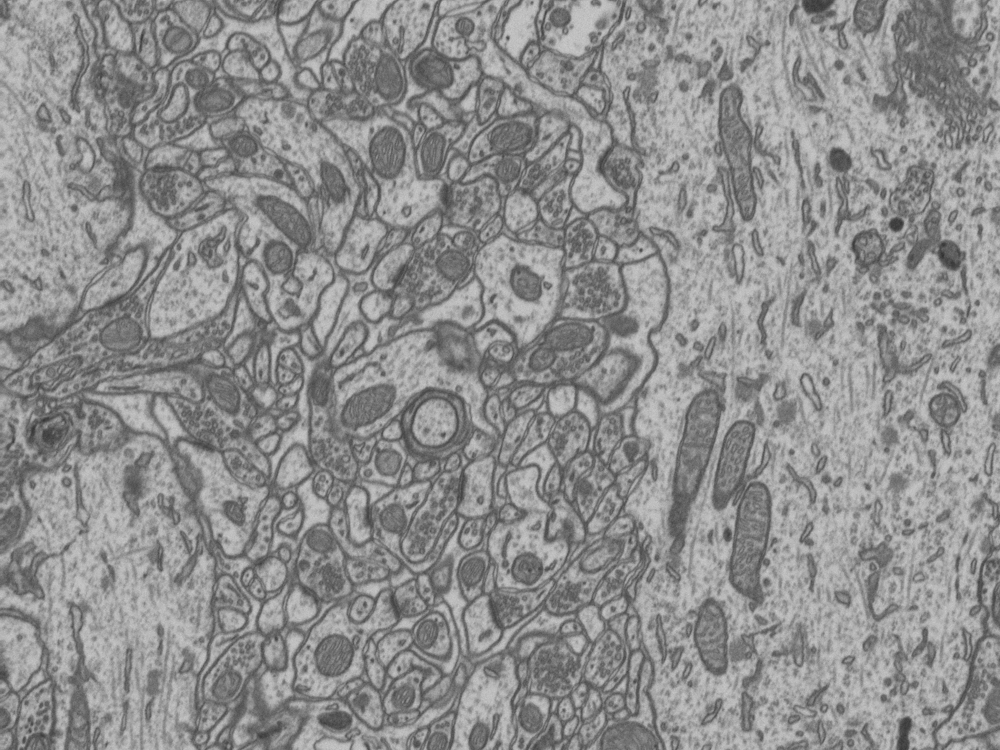
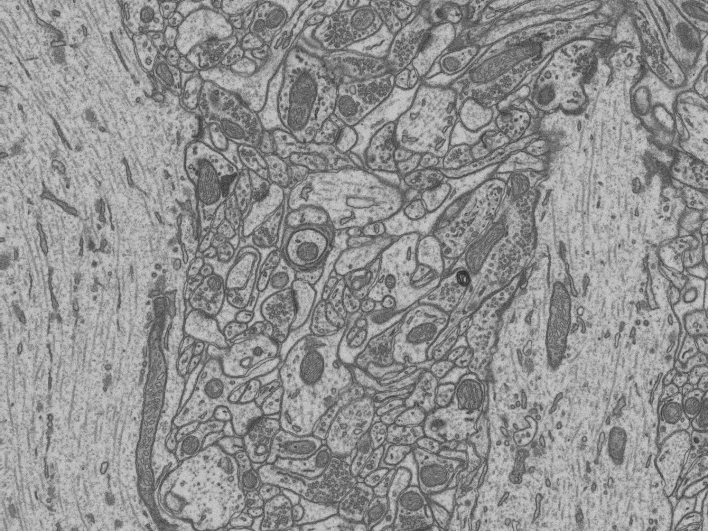

# Report Procedure

> Disclaimer: The assessment setup **DOES NOT** constitute a comprehensive quantitative assessment. Instead, it should be viewed as a rapid, initial evaluation of the performance of the tested models on synchrotron and electron microscopy data.

## Tested Images

The following images are used as test data for the evaluation of the tested models.

Synchrotron 1          |  Synchrotron 2
:-------------------------:|:-------------------------:
  |  

Electron Microscopy 1          |  Electron Microscopy 2
:-------------------------:|:-------------------------:
  |  

## Assessment Setup

To asses the out of the box performance of the tested models, the following procedure is followed:

1. Perform interactive segmentation on the masked areas of the test images in 2D.
2. Evaluate the segmentation results with the ground truths of the test images in 2D, across the whole dataset.
3. Test the segmentation across a full 3D dataset.

